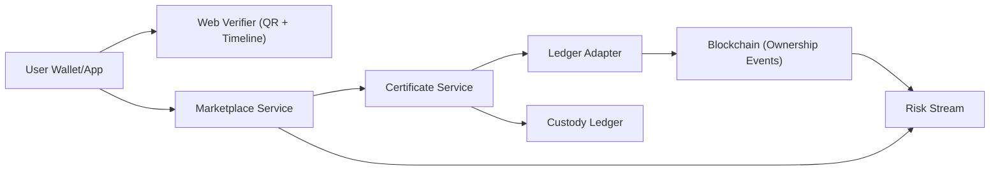

# Digital Gold Certificates (DGC)

Tamper-evident, peer-to-peer proof-of-ownership system for custodied physical gold.

This repository implements a portfolio-grade architecture where:
- Certificates are canonicalized, hashed, and digitally signed.
- Ownership movements are committed on-chain as verifiable events.
- Trading UX (listing, escrow, settlement, disputes) runs off-chain.
- Inventory reconciliation and risk signals protect operational integrity.

## Whitepaper

- Main reference: [Digital Gold Certificates Whitepaper (PDF)](./docs/whitepaper/Digital%20Gold%20Certificates%20Whitepaper.pdf)
- Date: February 08, 2026
- Scope: technical concept + BRD appendix for portfolio prototyping

## Why This Project Is Strong

- End-to-end verifiability: every transfer has cryptographic proof and blockchain lineage.
- Production-minded controls: reconciliation, freeze switches, risk scoring, and dispute hooks.
- Practical architecture: separates custody, certificate lifecycle, and marketplace settlement.
- Senior-level deliverables: threat model, timeline visualizer, auditable event streams.

## Core Capabilities

- Certificate issuance and signing (Ed25519)
- Canonical JSON hashing (RFC 8785 / JCS + SHA-256)
- On-chain ownership event registry
- QR/public verification view
- P2P listing + escrow lock + settlement flow
- Split certificate support for partial transfers
- Reconciliation checks between physical inventory and outstanding claims
- Risk stream for anomaly patterns (velocity, wash trading behavior, repeat disputes)

## High-Level Architecture



## Certificate Lifecycle

`ISSUED -> ACTIVE -> LOCKED -> TRANSFERRED/SPLIT -> REDEEMED`  
`REVOKED` is a terminal safety state for invalid/fraud scenarios.

## Monorepo Structure

- `contracts/` Hardhat smart contracts and tests
- `services/certificate-service/` certificate lifecycle APIs
- `services/ledger-adapter/` chain proof commit/verify adapter
- `services/marketplace-service/` listing, escrow, settlement logic
- `services/risk-stream/` event-driven risk scoring pipeline
- `apps/web-verifier/` public certificate verifier UI (Next.js)
- `packages/shared/` shared crypto utilities and domain types
- `docs/whitepaper/` whitepaper and supporting docs

## Requirements

- Node.js >= 20
- pnpm >= 9

## Quick Start

```bash
pnpm install
pnpm dev
```

Run tests:

```bash
pnpm -C contracts test
```

## Milestone 7 (Current)

Milestone 7 introduces a local risk-scoring stream:
- `risk-stream` service with SQLite persistence (`RISK_DB_PATH`)
- Ingestion endpoints:
  - `POST /ingest/ledger-event`
  - `POST /ingest/listing-audit-event`
- Risk query endpoints:
  - `GET /risk/certificates/:certId`
  - `GET /risk/listings/:listingId`
- Risk heuristics MVP:
  - transfer velocity spikes
  - wash-loop transfer patterns (back-and-forth owner movement)
  - repeated lock/cancel and timeout-driven cancellation patterns
- `ledger-adapter` and `marketplace-service` can publish events to risk-stream via `RISK_STREAM_URL`

Milestone 6 marketplace hardening remains active:
- `marketplace-service` endpoints:
  - `GET /listings?status=OPEN|LOCKED|SETTLED|CANCELLED`
  - `POST /listings/create`
  - `GET /listings/:listingId/audit`
  - `GET /listings/:listingId`
  - `POST /escrow/lock`
  - `POST /escrow/settle`
  - `POST /escrow/cancel`
- `marketplace-service` now uses SQLite persistence (`MARKETPLACE_DB_PATH`) so data survives restart.
- Escrow operations (`lock/settle/cancel`) now require `Idempotency-Key` request header.
- Audit trail is stored per listing (`CREATED`, `LOCKED`, `SETTLED`, `CANCELLED`).
- Escrow orchestration to `certificate-service`:
  - `lock` moves certificate status to `LOCKED`
  - `settle` unlocks to `ACTIVE`, then transfers ownership
  - `cancel` on locked listing unlocks certificate back to `ACTIVE`
- Hardcoded private keys removed from runtime defaults:
  - `ISSUER_PRIVATE_KEY_HEX` must be set for `certificate-service`
  - `CHAIN_PRIVATE_KEY` must be set when `DGC_REGISTRY_ADDRESS` is enabled in `ledger-adapter`

## Run Milestone 7 On Localhost (With Local Chain)

If `pnpm` is not installed globally, use `corepack pnpm`.

```bash
corepack pnpm install
corepack pnpm -C packages/shared build
corepack pnpm -C contracts build
```

Start local chain (terminal 1):

```bash
corepack pnpm -C contracts dev
```

Deploy `DGCRegistry` (terminal 2):

```bash
corepack pnpm -C contracts deploy:local
# output: DGC_REGISTRY_ADDRESS=0x...
```

Prepare environment keys (terminal 3):

```bash
export ISSUER_PRIVATE_KEY_HEX="$(openssl rand -hex 32)"
export CHAIN_PRIVATE_KEY="<YOUR_LOCAL_CHAIN_PRIVATE_KEY>"
```

Start ledger adapter with chain config (terminal 3):

```bash
PORT=4103 \
CHAIN_RPC_URL=http://127.0.0.1:8545 \
CHAIN_PRIVATE_KEY=<YOUR_LOCAL_CHAIN_PRIVATE_KEY> \
DGC_REGISTRY_ADDRESS=<PASTE_DEPLOYED_ADDRESS> \
RISK_STREAM_URL=http://127.0.0.1:4104 \
corepack pnpm -C services/ledger-adapter dev
```

Start certificate service (terminal 4):

```bash
PORT=4101 \
ISSUER_PRIVATE_KEY_HEX=<YOUR_ISSUER_PRIVATE_KEY_HEX> \
CERT_DB_PATH=./data/certificate-service.db \
LEDGER_ADAPTER_URL=http://127.0.0.1:4103 \
corepack pnpm -C services/certificate-service dev
```

Start marketplace service (terminal 5):

```bash
PORT=4102 \
CERTIFICATE_SERVICE_URL=http://127.0.0.1:4101 \
MARKETPLACE_DB_PATH=./data/marketplace-service.db \
RISK_STREAM_URL=http://127.0.0.1:4104 \
corepack pnpm -C services/marketplace-service dev
```

Start risk-stream service (terminal 6):

```bash
PORT=4104 \
RISK_DB_PATH=./data/risk-stream.db \
corepack pnpm -C services/risk-stream dev
```

Service URLs:
- `http://127.0.0.1:4101` (certificate-service)
- `http://127.0.0.1:4102` (marketplace-service)
- `http://127.0.0.1:4103` (ledger-adapter)
- `http://127.0.0.1:4104` (risk-stream)
- `http://127.0.0.1:8545` (Hardhat local chain)
- `http://127.0.0.1:3000` (web-verifier)

Check chain connectivity from ledger-adapter:

```bash
curl http://127.0.0.1:4103/chain/status
```

Issue certificate:

```bash
curl -X POST http://127.0.0.1:4101/certificates/issue \
  -H "content-type: application/json" \
  -d '{"owner":"0xabc999","amountGram":"1.0000","purity":"999.9","metadata":{"source":"localhost"}}'
```

Verify certificate:

```bash
curl -X POST http://127.0.0.1:4101/certificates/verify \
  -H "content-type: application/json" \
  -d '{"certId":"<CERT_ID_FROM_ISSUE_RESPONSE>"}'
```

Get anchored proof:

```bash
curl http://127.0.0.1:4103/proofs/<CERT_ID_FROM_ISSUE_RESPONSE>
```

Record event directly (returns `ledgerTxRef` when chain is enabled):

```bash
curl -X POST http://127.0.0.1:4103/events/record \
  -H "content-type: application/json" \
  -d '{"event":{"type":"STATUS_CHANGED","certId":"<CERT_ID>","occurredAt":"2026-02-11T03:00:00.000Z","status":"LOCKED"}}'
```

Transfer certificate:

```bash
curl -X POST http://127.0.0.1:4101/certificates/transfer \
  -H "content-type: application/json" \
  -d '{"certId":"<CERT_ID>","toOwner":"0xnewowner","price":"1000.0000"}'
```

Split certificate:

```bash
curl -X POST http://127.0.0.1:4101/certificates/split \
  -H "content-type: application/json" \
  -d '{"parentCertId":"<CERT_ID>","toOwner":"0xchildowner","amountChildGram":"0.2500"}'
```

Change status:

```bash
curl -X POST http://127.0.0.1:4101/certificates/status \
  -H "content-type: application/json" \
  -d '{"certId":"<CERT_ID>","status":"LOCKED"}'
```

Create listing:

```bash
curl -X POST http://127.0.0.1:4102/listings/create \
  -H "content-type: application/json" \
  -d '{"certId":"<CERT_ID>","seller":"0xabc999","askPrice":"1200.0000"}'
```

Lock escrow:

```bash
curl -X POST http://127.0.0.1:4102/escrow/lock \
  -H "idempotency-key: lock-001" \
  -H "content-type: application/json" \
  -d '{"listingId":"<LISTING_ID>","buyer":"0xbuyer001"}'
```

Settle escrow:

```bash
curl -X POST http://127.0.0.1:4102/escrow/settle \
  -H "idempotency-key: settle-001" \
  -H "content-type: application/json" \
  -d '{"listingId":"<LISTING_ID>","buyer":"0xbuyer001","settledPrice":"1195.0000"}'
```

Cancel escrow:

```bash
curl -X POST http://127.0.0.1:4102/escrow/cancel \
  -H "idempotency-key: cancel-001" \
  -H "content-type: application/json" \
  -d '{"listingId":"<LISTING_ID>","reason":"buyer_timeout"}'
```

List listings by status:

```bash
curl "http://127.0.0.1:4102/listings?status=OPEN"
```

Get listing audit trail:

```bash
curl http://127.0.0.1:4102/listings/<LISTING_ID>/audit
```

Get certificate risk profile:

```bash
curl http://127.0.0.1:4104/risk/certificates/<CERT_ID>
```

Get listing risk profile:

```bash
curl http://127.0.0.1:4104/risk/listings/<LISTING_ID>
```

Certificate status responses:

- Valid status values: `ACTIVE`, `LOCKED`, `REDEEMED`, `REVOKED`
- Allowed transitions:
  - `ACTIVE -> LOCKED | REDEEMED | REVOKED`
  - `LOCKED -> ACTIVE | REDEEMED | REVOKED`
  - `REDEEMED` and `REVOKED` are terminal (cannot transition again)

Success response (`200`):

```json
{
  "certificate": {
    "payload": {
      "certId": "DGC-...",
      "status": "LOCKED"
    }
  },
  "proofAnchorStatus": "ANCHORED",
  "proof": {
    "proofHash": "..."
  },
  "eventWriteStatus": "RECORDED"
}
```

Conflict response (`409`, invalid transition):

```json
{
  "error": "state_conflict",
  "message": "Transition REDEEMED -> ACTIVE is not allowed"
}
```

Not found response (`404`):

```json
{
  "error": "certificate_not_found"
}
```

Read timeline:

```bash
curl http://127.0.0.1:4101/certificates/<CERT_ID>/timeline
```

Run verifier app:

```bash
CERTIFICATE_SERVICE_URL=http://127.0.0.1:4101 corepack pnpm -C apps/web-verifier dev
```

OpenAPI:

```bash
curl http://127.0.0.1:4101/openapi.json
```

Run tests:

```bash
corepack pnpm -C contracts test
corepack pnpm -C services/marketplace-service test
corepack pnpm -C services/risk-stream test
corepack pnpm -C services/ledger-adapter test
corepack pnpm -C services/certificate-service test
```

## Security Notes

- Issuer keys should be managed with KMS/HSM in production.
- Public chain data should remain pseudonymous (no direct personal identity).
- Reconciliation should enforce:

```text
total_physical_gold_gram >= sum(outstanding_certificate_amount_gram)
```

## Current Scope

This is a portfolio prototype.  
It demonstrates cryptographic integrity, ownership auditability, and P2P flow design.  
It is not legal, financial, or regulatory advice.

## Maintainer

- GitHub: [@helllotrei](https://github.com/helllotrei)
