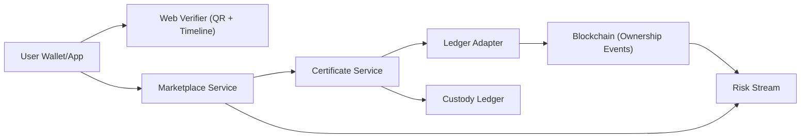

# Digital Gold Certificates (DGC)

Tamper-evident, peer-to-peer proof-of-ownership system for custodied physical gold.

This repository implements a portfolio-grade architecture where:
- Certificates are canonicalized, hashed, and digitally signed.
- Ownership movements are committed on-chain as verifiable events.
- Trading UX (listing, escrow, settlement, disputes) runs off-chain.
- Inventory reconciliation and risk signals protect operational integrity.

## Whitepaper

- Main reference: [Digital Gold Certificates Whitepaper (PDF)](./docs/whitepaper/Digital%20Gold%20Certificates%20Whitepaper.pdf)
- Date: February 08, 2026
- Scope: technical concept + BRD appendix for portfolio prototyping

## Why This Project Is Strong

- End-to-end verifiability: every transfer has cryptographic proof and blockchain lineage.
- Production-minded controls: reconciliation, freeze switches, risk scoring, and dispute hooks.
- Practical architecture: separates custody, certificate lifecycle, and marketplace settlement.
- Senior-level deliverables: threat model, timeline visualizer, auditable event streams.

## Core Capabilities

- Certificate issuance and signing (Ed25519)
- Canonical JSON hashing (RFC 8785 / JCS + SHA-256)
- On-chain ownership event registry
- QR/public verification view
- P2P listing + escrow lock + settlement flow
- Split certificate support for partial transfers
- Reconciliation checks between physical inventory and outstanding claims
- Risk stream for anomaly patterns (velocity, wash trading behavior, repeat disputes)

## High-Level Architecture



## Certificate Lifecycle

`ISSUED -> ACTIVE -> LOCKED -> TRANSFERRED/SPLIT -> REDEEMED`  
`REVOKED` is a terminal safety state for invalid/fraud scenarios.

## Monorepo Structure

- `contracts/` Hardhat smart contracts and tests
- `services/certificate-service/` certificate lifecycle APIs
- `services/ledger-adapter/` chain proof commit/verify adapter
- `services/marketplace-service/` listing, escrow, settlement logic
- `services/risk-stream/` event-driven risk scoring pipeline
- `apps/web-verifier/` public certificate verifier UI (Next.js)
- `packages/shared/` shared crypto utilities and domain types
- `docs/whitepaper/` whitepaper and supporting docs

## Requirements

- Node.js >= 20
- pnpm >= 9

## Quick Start

```bash
pnpm install
pnpm dev
```

Run tests:

```bash
pnpm -C contracts test
```

## Milestone 1 (Current)

Milestone 1 focuses on certificate lifecycle foundations without cross-service dependency:
- Shared API contract types for issue/verify requests and responses.
- `certificate-service` endpoints:
  - `POST /certificates/issue`
  - `POST /certificates/verify`
  - `GET /certificates/:certId`
- In-memory certificate storage for local prototyping.
- Integration tests for issue/fetch/verify and tamper detection.

## Run Milestone 1 On Localhost

If `pnpm` is not installed globally, use `corepack pnpm`.

```bash
corepack pnpm install
corepack pnpm -C packages/shared build
corepack pnpm -C services/certificate-service dev
```

Service URL:
- `http://127.0.0.1:4101`

Issue certificate:

```bash
curl -X POST http://127.0.0.1:4101/certificates/issue \
  -H "content-type: application/json" \
  -d '{"owner":"0xabc999","amountGram":"1.0000","purity":"999.9","metadata":{"source":"localhost"}}'
```

Verify certificate:

```bash
curl -X POST http://127.0.0.1:4101/certificates/verify \
  -H "content-type: application/json" \
  -d '{"certId":"<CERT_ID_FROM_ISSUE_RESPONSE>"}'
```

Run tests:

```bash
corepack pnpm -C services/certificate-service test
```

## Security Notes

- Issuer keys should be managed with KMS/HSM in production.
- Public chain data should remain pseudonymous (no direct personal identity).
- Reconciliation should enforce:

```text
total_physical_gold_gram >= sum(outstanding_certificate_amount_gram)
```

## Current Scope

This is a portfolio prototype.  
It demonstrates cryptographic integrity, ownership auditability, and P2P flow design.  
It is not legal, financial, or regulatory advice.

## Maintainer

- GitHub: [@helllotrei](https://github.com/helllotrei)
